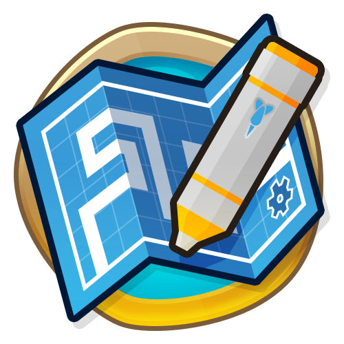

<h1 align="center">

Tower DPS Display
</h1>

### Adds a button on the pause screen that shows you how much money you got from pops, farms, etc.

* "Income" button in the pause screen
* Tracking income sources from pops, farms, and eco
* Absolute value and percentage of contribution to your total money

